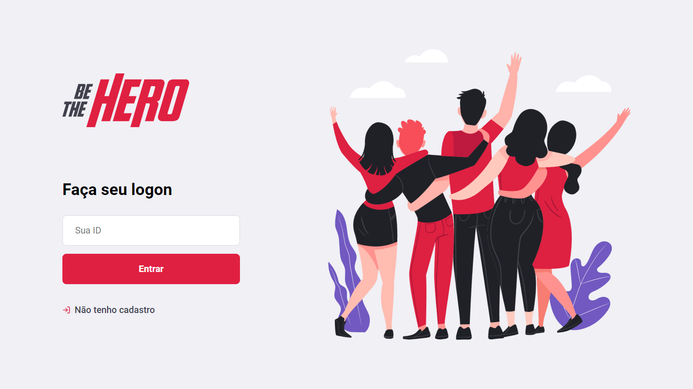
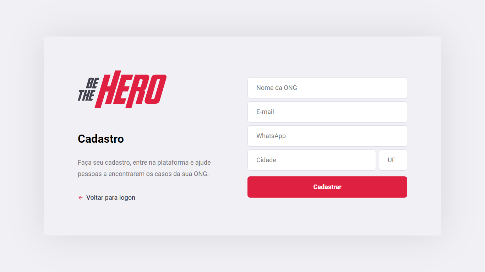
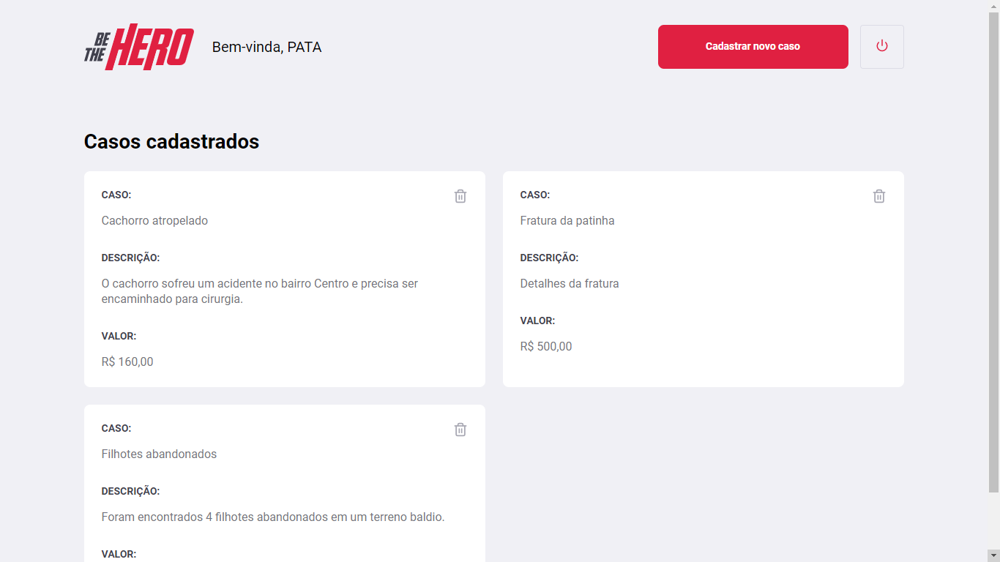
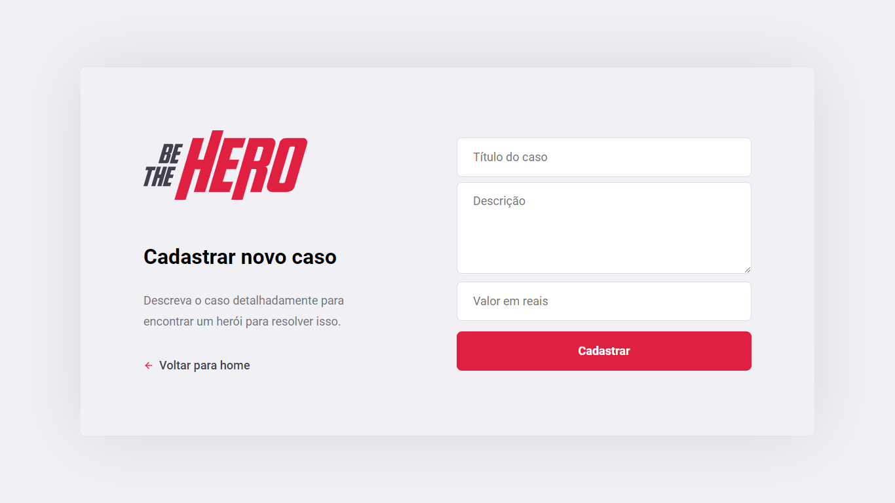
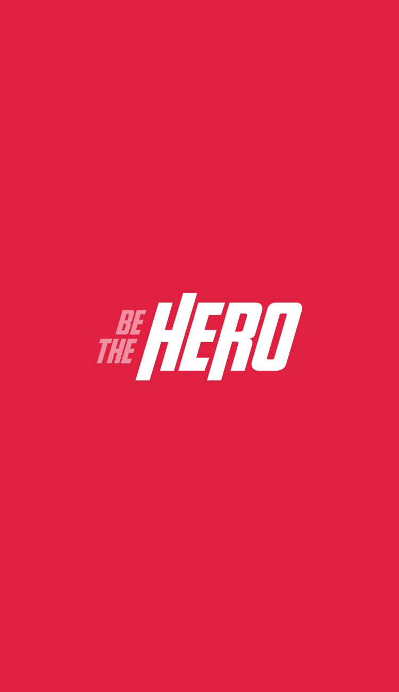
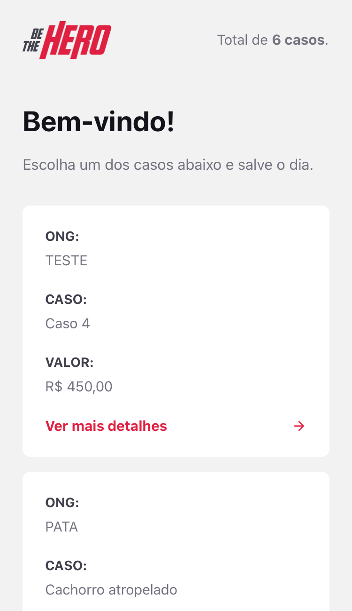
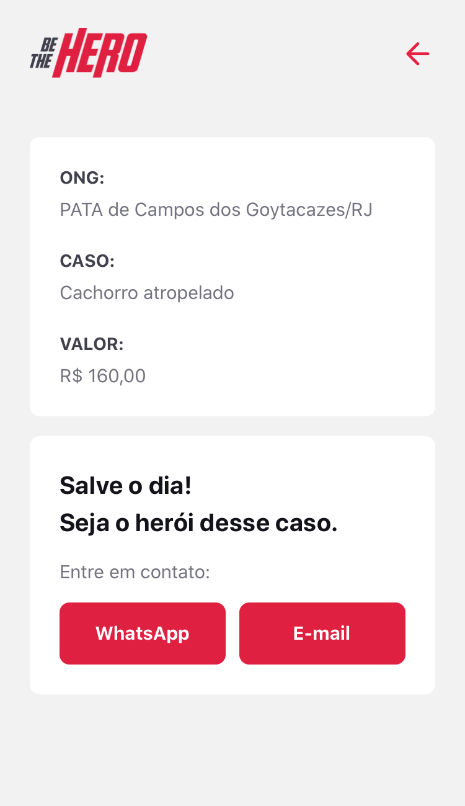
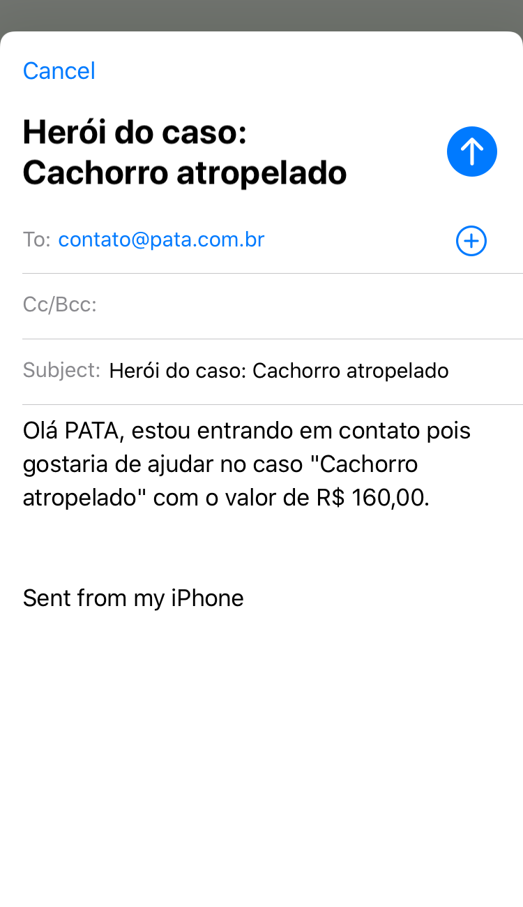
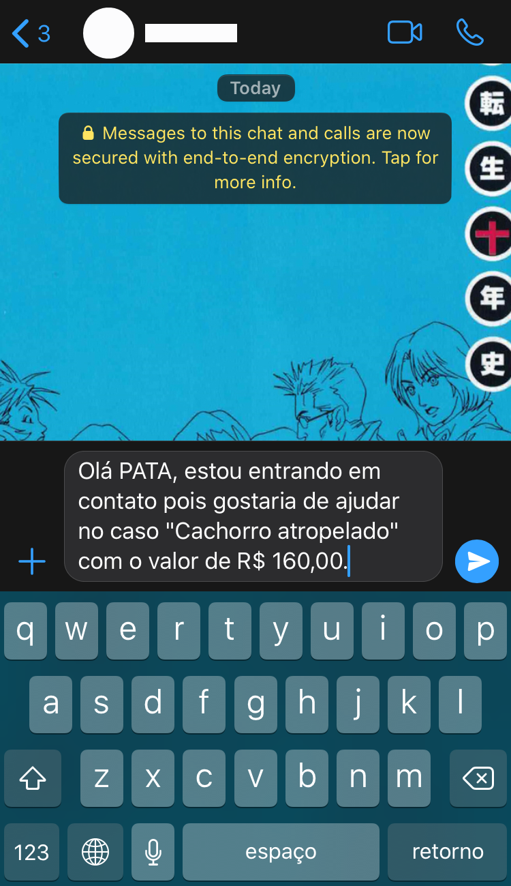

<h1 align="center">
    
</h1>
<p align="center">
  

  
	
  <a href="https://www.linkedin.com/in/lucas-diniz-santos-henrique-3aa825157/">
    
  </a>

  <a>
    
  </a>

  <a>
    
  </a>
  
</p>
BeTheHero is an application created for NGOs during the OmniStack Week course using Node.js, React.js and React Native. This app connects NGOs with people who are able to help others. NGOs are registered through the web application and creates incidents that require donations. 
Through the mobile app, people can see which incidents are reported and contact NGOs to become heroes.

## Technologies
In this project the following technologies were used:
* Node.js;
* React;
* React Native;
* SQLite;
* Expo.

## How To Use

### Clone this repository

```$ git clone https://github.com/lcsdiniz/BeTheHero.git```

### Go into the directory
```$ cd Be-The-Hero/backend```

### Install the dependencies
```$ npm install```

### Repeat the installation of dependecies in the "backend" and "mobile" directories
```$ cd Be-The-Hero/frontend```  
```$ npm install```

```$ cd Be-The-Hero/mobile```  
```$ npm install```

### Running the API

#### Web version 
Run ```npm start``` in both backend and frontend directories.
Access the application from **localhost:3000**.

#### Mobile version
If you do not have the expo-cli on your computer, install it with ```npm install -g expo-cli```.  
Run ```npm start``` in backend directory and ```expo start``` in the mobile directory. 
Access **localhost:19002**, read the QR Code in your smartphone and use the app Expo to run the mobile version.

## Screens

### Web

#### 1 - Initial page



#### 2 - Sign up page



#### 3 - Home page



#### 4 - New case registration



### Mobile

#### 1 - Splash


#### 2 - Incident list


#### 3 - Incident details


#### 4 - Email sending by the app


#### 5 - Whatsapp message sending by the app


## Features
The main features of the application are:

### Web
* Create new cases;
* Delete cases;

### Mobile
* Send e-mails;
* Send messages to Whatsapp.

## Version
1.0.0.0

## Authors
* **Lucas Diniz** 

Thanks for the visit!
